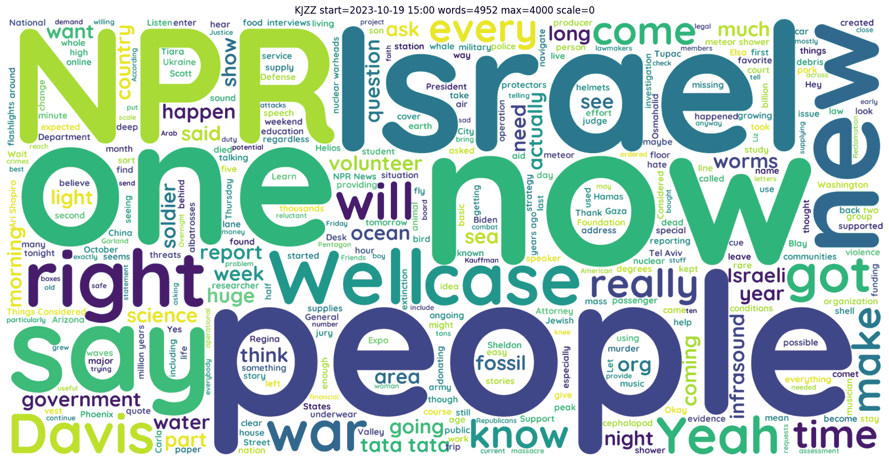

# BiasBuster - release 0.9.8 html_builder

Identify and challenge bias in language wording, primarily directed at KJZZ's radio broadcast. 
BiasBuster provides an automated stream downloader, a SQLite database, and Python functions to output visual statistics.

<div align="center"> 
  
  
  
  
  
  
</div>

BiasBuster Will provide a UI and option to process+manage other broadcasts very soon.

Comes in 2 parts: 
- Linux part for a Cloud server, to download the mp3 (bash)
- Windows part, to transcribe mp3 to text, SQLite database management, and word analysis

The meat of the project is currently KJZZ-db.py that works on Windows. 
It should be portable to Linux as-is.


# Under the hood

## Linux part: kjzz.sh
Currently, this application only downloads KJZZ's broadcast, available at https://kjzz.streamguys1.com/kjzz_mp3_128

You can certainly rewrite it for Windows if you like.

### Usage
The script accepts 2 parameters:
- *start*:  starts the download according to KJZZ-schedule.json
- *stop*:   kills current download if you want to

`kjzz.sh` will download chunks of 30mn, minus the musical programs of the night (sleep). Simply schedule CRON with this one line, to get 30mn long mp3 files under ISO week number folders (week starts Monday):
`# 0,1,30,31 * * * *   root /path/BiasBuster/kjzz.sh start`

This script will create a pid lock file with its runing PID, ensuring not 2 runs at the same time. When you run the script, it will tell you if it's running or not. Example:
`./kjzz.sh`
```
                             16:23
filename=KJZZ_2023-10-20_Fri_1600-1630_All Things Considered.mp3
kjzzDownloader 1859415 is appending "KJZZ_2023-10-20_Fri_1600-1630_All Things Considered.mp3" for the next 6 mm = 374 s. stop it?
```

### KJZZ schedule: KJZZ-schedule.json
This schedule comes from their official website at https://kjzz.org/kjzz-print-schedule

The structure is pretty simple, and simply lists by hour and by Day, what the program name is:
```
{
  "00:00": {
    "Mon": "BBC World Service",
    "Tue": "Classic Jazz with Chazz Rayburn",
    "Wed": "Classic Jazz with Bryan Houston",
    "Thu": "Classic Jazz with Bryan Houston",
    "Fri": "Classic Jazz with Michele Robins",
    "Sat": "Classic Jazz with Michele Robins",
    "Sun": "BBC World Service"
  },
  ...
```

The schedule does not look like it's going to change until next year.


## Windows part 1: BiasBuster-whisper.cmd
- Transcribe the mp3 to text with Purfview/whisper-standalone-win and CUDA.
The whole point of using Windows is to put this GTX 3090 to good use. 
Whisper-Faster is compiled and ready to use. 
I tried my best to compile whisper, whisper-bin-x64, and whisper-cpp, but failed miserably. 
Compiling it apparently requires you to install 6GB of CUDA SDK on Windows. My C: drive is full, sorry.

Here is how to transcribe the mp3 downloaded:

1. Have a CUDA GPU
2. install Whisper-Faster from https://github.com/Purfview/whisper-standalone-win
3. add cuBLAS.and.cuDNN as required
4. update `BiasBuster-whisper.cmd` to point to Whisper-Faster folder
5. copy `BiasBuster-whisper.cmd` as a shortcut in the sendTo folder (access by typing `shell:sendTo`)
6. download mp3 from your Cloud server
7. right-click the folder and select _BiasBuster-whisper_
8. watch the magic of IA transcription

The script as it is, will produce multiple text file formats, but this project only uses `.text` extensions at the moment: pure text, no timestamps.


## Windows part 2: KJZZ-db.py
This Python script does the following:

- Load the text files into SQLite `kjzz.db`
- Exploits the data to produce statistics and graphics
  - [x] import single mp3
  - [x] import all mp3 in a folder
  - [x] query statistics on what is stored
  - [x] query words based on schedule
  - [x] generate word cloud
  - [x] generate misInformation analysis heatmap only for programs
  - [x] generate html week pages for chunks
  - [x] generate html week pages for programs
  - [x] generate html week pages that have pictures
  - [x] generate html week pages that have links
  - [x] generate html week pages that can navigate
  - [x] generate html week pages and also missing wordCloud pictures
  - [ ] generate gender bias analysis
  - [ ] generate html week pages that are useful
  - [ ] generate html week pages that are interactive
  - [ ] what else?


### Usage
`python KJZZ-db.py --help`

```
usage: python KJZZ-db.py --help

  --import < --text "KJZZ_2023-10-13_Fri_1700-1730_All Things Considered.text" | --folder inputFolder >
    -m, --model *small medium large...
                   Model that you used with whisper, to transcribe the text to import.
    -p, --pretty
                   Convert \n to carriage returns and does json2text.
                   Ignored when outputing pictures.
    --output *kjzz
                   Folder where to output pictures..
    --show
                   Opens the picture upon generation.
    --dryRun
                   Will not generate PICtures, will not import chunks.

  --db *kjzz.db    Path to the local SQlite db.
  -q, --query < title | first | last | last10 | byDay | byTitle | chunkLast10 >
                   Quick and dirty way to see what's in the db.

  --html [--byChunk --printOut --autoGenerate] <week>
                   PICture: generate week number's schedule as an html table.
                   Outputs html file: kjzz/week00[-byChunk].html
                   --byChunk  Outputs schedule by 30mn chucks, no rowspan, no picture.
                   --printOut Will output html on the prompt.
                   --autoGenerate Will loop generate all wordCloud PICtures to show in html for that week.

  -g, --gettext < selector=value : chunk= | date= | datetime= | week= | Day= | time= | title= >
                   Outputs all text from the selector:
                   chunk="KJZZ_YYYY-mm-DD_Ddd_HHMM-HHMM_Title" (run KJZZ-db.py -q chunkLast10 to get some values)
                   date=2023-10-08[+time=HH:MM]
                   datetime="2023-10-08 HH:MM"
                   week=42 (iso week with Mon first)
                   Day=Fri (Ddd)
                   title="title of the show", see https://kjzz.org/kjzz-print-schedule
          example: chunk="KJZZ_2023-10-13_Fri_1700-1730_All Things Considered"
                   Will get text from that chunk of programming only. Chunks are 30mn long.
          example: week=41+Day=Fri+title="All Things Considered"
                   Same as above but will get text from the entire episode.
   *--printOut
                   Will output selected text on the prompt (default if no other option passed).
    --noMerge
                   Do not merge 30mn chunks of the same title within the same timeframe.
    --misInformation
                   PICture: generate misInformation graph or heatmap for all 4 factors:
                   explanatory/retractors/sourcing/uncertainty
      --graph *bar | pie | line
                   What graph you want. Ignored with --noMerge: heat map will be generated instead.
    --wordCloud
                   PICture: generate word cloud from gettext output. Will not output any text.
      --stopLevel  0 1 2 3 *4
                   add various levels of stopwords
        --listLevel <0[,1 ..]> to just show the words in that level(s).

      --max_words *1000 int (default=1000)
               The maximum number of words in the Cloud.
      --width *2000 int (default=2000)
               Width of the canvas.
      --height *1000 int (default=1000)
               Height of the canvas.
      --min_word_length *3 int, default=3
               Minimum number of letters a word must have to be included.
      --min_font_size *4 int (default=4)
               Smallest font size to use. Will stop when there is no more room in this size.
      --max_font_size *400  int or None (default=400)
               Maximum font size for the largest word. If None, height of the image is used.
      --scale *1.0 float (default=1.0)
               Scaling between computation and drawing. For large word-cloud images,
               using scale instead of larger canvas size is significantly faster, but
               might lead to a coarser fit for the words.
      --relative_scaling *auto float (default='auto')
               Importance of relative word frequencies for font-size.  With
               relative_scaling=0, only word-ranks are considered.  With
               relative_scaling=1, a word that is twice as frequent will have twice
               the size.  If you want to consider the word frequencies and not only
               their rank, relative_scaling around .5 often looks good.
               If 'auto' it will be set to 0.5 unless repeat is true, in which
               case it will be set to 0.
      --background_color *white color value (default='white')
               Background color for the word cloud image.
      --normalize_plurals *True bool, default=True
               Whether to remove trailing 's' from words. If True and a word
               appears with and without a trailing 's', the one with trailing 's'
               is removed and its counts are added to the version without
               trailing 's' -- unless the word ends with 'ss'. Ignored if using
               generate_from_frequencies.
      --inputStopWordsFiles *[] file, default=None
               Text file containing one stopWord per line.
               You can pass --inputStopWordsFiles multiple times.
      --font_path *fonts\Quicksand-Bold.ttf str, default='fonts\Quicksand-Bold.ttf'
               Font path to the font that will be used (OTF or TTF).
      --collocation_threshold *30 int, default=30
               Bigrams must have a Dunning likelihood collocation score greater than this
               parameter to be counted as bigrams. Default of 30 is arbitrary.
               See Manning, C.D., Manning, C.D. and Schütze, H., 1999. Foundations of
               Statistical Natural Language Processing. MIT press, p. 162
               https://nlp.stanford.edu/fsnlp/promo/colloc.pdf#page=22

  -v, --verbose
                   -vv -vvv increase verbosity.
  --silent
                   Not verbose.
```

### File naming convention

#### For KJZZ
Mp3 files must be named like so, in order to be matched against KJZZ-schedule.json during loading of the database:

```
KJZZ_2023-10-13_Fri_1700-1730_All Things Considered.text
     ^          ^   ^         ^                     ^
     YYYY-MM-DD Day HHMM      Program name          text (for folder import)
```

_Day_ is redundant since we have the date, but makes the chunk name and database, convenient to interact with.


# KJZZ-db.py Usage

KJZZ-db.py needs at least `--import | --query | --gettext`.

## Import new data
`-i, --import` *--text file | --folder folder*

### Import text files in the Database
`python KJZZ-db.py --import --folder kjzz\\42`

Will import every text file in the folder "kjzz\42" (week 42).
--import will always avoid chunks already present in the database.

```
  db_init: 314 chunks found in kjzz.db
    db_load: Chunk already exist: KJZZ_2023-10-16_Mon_0000-0030_BBC World Service.text
    db_load: Chunk already exist: KJZZ_2023-10-16_Mon_0030-0100_BBC World Service.text
    ...
    db_load: Chunk added: KJZZ_2023-10-18_Wed_1030-1100_Here and Now.text
    db_load: Chunk added: KJZZ_2023-10-18_Wed_1100-1130_Here and Now.text
    ...
Loading... ---------------------------------------- 100% 0:00:00
  db_load: done loading 53/146 files
```
If you need a --force option to overwrite existing chunks, please file a PR.


## Query database
`-q, --query` *title first last last10 byDay byTitle chunkLast10*

Quick and dirty way to see what's in the db.


### Database titles overview

`python KJZZ-db.py -q byTitle`

Outputs how many 30mn chunks are stored, by title and by Day:
```
[
  ('All Things Considered', 'Fri', 6),
  ('All Things Considered', 'Mon', 6),
  ('All Things Considered', 'Sat', 2),
  ('All Things Considered', 'Sun', 2),
  ...
```

### Database title flat listing

`python KJZZ-db.py -q title --pretty`

Outputs alphabetically sorted list of all programing in the database, useful for loops for instance:
```
"All Things Considered"
"BBC Newshour"
"BBC World Business Report"
"BBC World Service"
"Bullseye"
"Climate One"
...
```

### List the last chunks loaded
`python KJZZ-db.py --query chunkLast10 -pretty`

Adding _pretty_ will flatten the output as simple text:

```
"KJZZ_2023-10-19_Thu_1930-2000_Fresh Air"
"KJZZ_2023-10-19_Thu_1900-1930_Fresh Air"
"KJZZ_2023-10-19_Thu_1830-1900_BBC World Business Report"
"KJZZ_2023-10-19_Thu_1800-1830_Marketplace"
"KJZZ_2023-10-19_Thu_1730-1800_All Things Considered"
"KJZZ_2023-10-19_Thu_1700-1730_All Things Considered"
"KJZZ_2023-10-19_Thu_1630-1700_All Things Considered"
"KJZZ_2023-10-19_Thu_1600-1630_All Things Considered"
"KJZZ_2023-10-19_Thu_1530-1600_All Things Considered"
"KJZZ_2023-10-19_Thu_1500-1530_All Things Considered"
```

## gettext
`-g, --gettext` * chunk= | date= | datetime= | week= | Day= | time= | title= *

validKeys = they will be used as parameters for the SQL query:
- chunk="KJZZ_YYYY-mm-DD_Ddd_HHMM-HHMM_Title"
- date=2023-10-08[+time=HH:MM]
- datetime="2023-10-08 HH:MM"
- week=42 (iso week with Mon first)
- Day=Fri (Ddd)
- title="title of the show", see https://kjzz.org/kjzz-print-schedule


You can also combine the keys with *+*, examples:
- ALL of BBC Newshour for week 41: `--gettext week=41+title="BBC Newshour"`
- ALL programs for a specific day [and time]: `--gettext date=2023-10-08[+time=HH:MM]`
- ALL programs for a specific week: `--gettext week=42`
- Specific date and time (30mn chunk): `--gettext datetime="2023-10-08 HH:MM"`


### Get the text for a particular chunk
`python KJZZ-db.py --gettext chunk="KJZZ_2023-10-13_Fri_1700-1730_All Things Considered" -p`


### Get the text for a particular program, ALL dates
`python KJZZ-db.py --gettext title="All Things Considered" -p`


### Generate a word Cloud for a particular chunk of program
`python KJZZ-db.py -g chunk="KJZZ_2023-10-19_Thu_1500-1530_All Things Considered" -v --wordCloud`

Verbose outpout:
```
wordCloud:     True
localSqlDb kjzz.db passed
  db_init kjzz.db
    cursor: 1 records
  db_init: 367 chunks found in kjzz.db
  gettext: SELECT text from schedule where 1=1 and start = '2023-10-19 15:00:00.000'
    cursor: 1 records
  gettext: image 1
    genWordCloud: most 10 common words before: [('the', 208), ('to', 142), ('a', 114), ('of', 110), ('in', 91), ('and', 89), ('that', 73), ('is',
70), ('this', 58), ('on', 49)]
    genWordCloud: most 10 common words after:  [('s', 68), ('you', 41), ('I', 37), ('are', 34), ('from', 32), ('they', 32), ('have', 24), ('like',
24), ('was', 23), ('so', 23)]
    genWordCloud: 4952 words - 195 stopWords == 3694 total words (1258 words removed)
    genWordCloud: stopWords = {"we're", 'nor', 'start=2023-10-19', 'they', "doesn't", 'we', 'on', 'me', 'can', 'out', 'get', "she's", 'about',
'few', 'once', "we'd", "you'd", 'of', "here's", 'is', 'www', 'but', "he'd", 'to', 'both', 'k', 'below', 'was', 'themselves', 'could', 'up',
'while', 'where', 'other', "shouldn't", 'like', 'or', 'same', 'what', 'myself', "it's", 'our', 'how', 'doing', 'her', 'ours', 'such', 'further',
'my', "there's", "couldn't", "they've", 'only', "i'll", 'it', 'then', 'therefore', 'else', 'which', 'after', 'just', 'for', 'be', 'very', 'at',
'are', 'since', 'being', 'r', 'against', 'too', 'should', 'having', 'were', 'in', 'them', "you're", 'yours', 'KJZZ', 'into', 'however', 'if',
'through', "why's", 'all', 'himself', 'more', "you've", 'otherwise', 'did', "she'd", "what's", "she'll", 'who', 'own', "wasn't", 'during',
"you'll", 'their', 'here', "won't", 'those', 'you', "who's", "didn't", "where's", 'has', "shan't", 'no', 'not', "can't", "hadn't", 'http',
'again', "don't", 'i', "aren't", 'ever', "let's", 'hence', 'with', 'until', 'whom', 'why', 'had', 'been', 'there', 'under', "we'll", "i'm",
'yourselves', 'am', "i'd", 'above', 'as', 'over', 'this', 'some', 'each', 'itself', 'from', 'between', 'that', "when's", "they're", 'off', 'any',
'an', 'the', "isn't", '15:00', 'and', "i've", 'his', "hasn't", 'most', "he'll", 'a', 'when', 'these', 'hers', 'by', "weren't", 'com', 'also',
'its', 'your', 'cannot', "haven't", "wouldn't", 'before', "they'll", 'than', 'yourself', 'ourselves', "he's", 'him', "how's", "they'd", 'ought',
"that's", 'because', 'do', 'herself', 'down', 'shall', 'she', 'he', 'does', "we've", 'so', 'would', 'have', "mustn't", 'theirs'}
    genWordCloud: file = "KJZZ start=2023-10-19 1500 words=4952 max=4000 scale=0.png"
```

wordCloud generated: Notice how it makes no sense as onlt the stop words are highlighted



### Generate a cloud a an episode of "Freakonomics" on week 42
`python KJZZ-db.py -g week=42+title="Freakonomics" --wordCloud --stopLevel 5 --show --max_words=1000 --inputStopWordsFiles stopWords.Wordlist-Adjectives-All.txt`


### Generate a cloud a an episode of "Freakonomics" on week 42 with smaller max font size
`python KJZZ-db.py -g week=42+title="Freakonomics" --wordCloud --stopLevel 5 --show --max_words=1000 --inputStopWordsFiles stopWords.Wordlist-Adjectives-All.txt`

Notice how more smaller words are stacked and make the cloud illegigle:


### Generate a cloud a an episode of "Freakonomics" on week 42 without stopWords

No stopWords: adjectives are now prominents and the cloud has no meaning anymore:

`python KJZZ-db.py -g week=42+title="Freakonomics" --wordCloud --stopLevel 0 --show --max_words=1000`


### Generate a PIE about how uncertain information is in a program

`python KJZZ-db.py --gettext week=42+title="Morning Edition"+Day=Mon --misInformation --graph pie --show`


### Generate a heat map about how uncertain information is in multiple chunks of a program

Simply add --noMerge: --graph will be ignored when treating multiple chunks, and output a heat map instead.

`python KJZZ-db.py --gettext week=42+title="Morning Edition"+Day=Mon --misInformation --noMerge --show`


### Batch to generate ALL word cloud pictures for each program of a given week

The loop below will generate png files for each program of each day of week 42:

`for /f "tokens=*" %t in ('python KJZZ-db.py -q title -p') DO (for %d in (Mon Tue Wed Thu Fri Sat Sun) DO python KJZZ-db.py -g week=42+title=%t+Day=%d --wordCloud --stopLevel 4 --max_words=1000 --inputStopWordsFiles stopWords.ranks.nl.txt --inputStopWordsFiles stopWords.Wordlist-Adjectives-All.txt --output kjzz)`

Notice how the order of --gettext parameters influence the file names: 
this is useful when you want your files sorted a certain way. 

The loop above will have them sorted by Title. 
If you want to have them sorted by Day, use `week=42+Day=%d+title=%t`.


### Generate html word cloud week

The loop below will generate png files for each program of each day of week 42 along with the html page:

`python KJZZ-db.py --html 42`


### Generate html word cloud week + all word clouds for each program available in the db

The loop below will generate png files for each program of each day of week 41 along with the html page:

`python KJZZ-db.py --html 41 --autoGenerate`


# Roadmap
- [ ] 0.9.?   TODO should the case matter for title?
- [ ] 0.9.?   TODO include some of the most offensive Hexspeak from https://en.wikipedia.org/wiki/Hexspeak to trigger fools
- [ ] 0.9.?   TODO separate KJZZ into its own table to add other broadcasters
- [ ] 0.9.?   TODO automate mp3 downloads from cloud + process + uploads from/to cloud server
- [ ] 0.9.?   TODO adding bias_score.py from https://github.com/auroracramer/language-model-bias
- [ ] 0.9.9   WIP
  - [x] stopped uploading the db after week 46: `git update-index --assume-unchanged kjzz.db`
  - [ ] auto-import mp3 to process via ssl batch putty or plink or smth
  - [ ] auto-upload processed text back to server via ssl batch putty or plink or smth
    - [ ] add bubble info tip popup full image on hover like 2 seconds? or a button?
    - [ ] add a modal for statistical analysis of a program
    - [ ] add social media share buttons for that modal
    - [ ] integrate buttons under each available image
    - [ ] integrate (re)generate picture(s)
    - [ ] integrate (re)generate misInformation heatMaps
    - [ ] integrate (re)generate biases
    - [ ] integrate listen to the recording
    - [ ] integrate mp3 player with queue for that chunk/program
    - [ ] integrate text display for that chunk/program
    - [ ] integrate text analysis with keyword search
    - [ ] color programings by bias/misInformation/etc
    - [ ] color wordClouds by bias/misInformation/etc
  - [ ] build an actual front page with Bootstrap or smth
  - [ ] extract presenters' names
  - [ ] save some statistics in the db: add more columns
  - [ ] highlight the top 10 BS of the week or smth
  - [ ] integrate front page with cgi or smth so we can ajax-build missing pictures or smth
  - [ ] integrate front page with cgi so we can tap in the database with SQLite worker
- [x] 0.9.8   release html_builder
  - [x] fixed error Tcl_AsyncDelete: async handler deleted by the wrong thread
  - [x] updated README.md
  - [x] wordCloud() and genWordCloud() can be called from anywhere
  - [x] added plt.close() to save memory
  - [x] rebuild wordCloud png file title where needed
  - [x] updated usage()
  - [x] passing progress bar value to relevant info() logger lines
  - [x] fixed logging levels almost everywhere
  - [x] renamed info to usage in wordCloudDict
  - [x] default stopLevel is indeed 4 not 0
  - [x] added automatic missing pictures where necessary
  - [x] added html progress bar
  - [x] added --autoGenerate and --dryRun
  - [x] frozen table headers
  - [x] added prev/next links
  - [x] perfected table generation
- [x] 0.9.7   standardised logging
  - [x] added --silent
  - [x] default verbose = 1
  - [x] standardised logging
- [x] 0.9.6   WIP web ui - actually just generates an html page of the week's programing
  - [x] added options --html --byChunk
  - [x] added home-made html table generator from json schedule
  - [x] html table has an okay look and shows existing wordClouds
  - [x] html and png are generated under their respective week's folder
  - [x] cleaned up usage() and created error() functions
  - [x] completed week 46 import
- [x] 0.9.5   added misInformation heatmap from https://github.com/PDXBek/Misinformation
- [x] 0.9.4   wordCloudDict parameters are auto-added to script arguments and --help is auto-build
- [x] 0.9.3   added and played with most of the genWordCloud parameters in wordCloudDict
- [x] 0.9.2   updated stopwords to level 5 + you can add many files with --inputStopWordsFiles
- [x] 0.9.1   added wordCloud from https://github.com/amueller/word_cloud/blob/main/examples/simple.py
- [x] 0.9.0   automated mp3 process with whisper-faster from https://github.com/Purfview/whisper-standalone-win

## Requirements

### Linux

- none

### Windows

- Python 3.x:
  - getopt, sys, os, re, regex, io, glob, time, datetime, pathlib, json, urllib, random, sqlite3, collections
- Python 3.x modules:
  - rich
  - pandas
  - numpy
  - matplotlib
  - seaborn
  - wordcloud
  - pngquant
- Windows software:
  - whisper-faster from https://github.com/Purfview/whisper-standalone-win


## Acknowledgements
- rich print:     https://github.com/Textualize/rich
- pngquant:       https://github.com/kornelski/pngquant
- wordCloud:      https://github.com/amueller/word_cloud
- gender bias:    https://github.com/auroracramer/language-model-bias
- misInformation: https://github.com/PDXBek/Misinformation
  - heatMap.explanatory.csv
  - heatMap.retractors.csv
  - heatMap.sourcing.csv
  - heatMap.uncertainty.csv
- IA transcribe:  https://github.com/Purfview/whisper-standalone-win
- stopWords lists: 
  - ranks.nl compilation:     https://www.ranks.nl/stopwords
    - stopWords.ranks.nl.txt
  - Thesaurus and adjectives: https://github.com/taikuukaits/SimpleWordlists/tree/master
    - stopWords.Wordlist-Adjectives-All.txt


## Support

👍🏻 If you're using this project & happy with it or you appreciate what I do and wish to support my work, you can consider by

⭐️ Starring & Sharing the project is also appreciated. Thanks! ❤️
[](https://reddit.com/submit?url=https://github.com/audioscavenger/BiasBuster&title=Discover%20the%20bias%20and%20the%20agenda%20of%20KJZZ%20radio%20broadcasts)
[](https://news.ycombinator.com/submitlink?u=https://github.com/audioscavenger/BiasBuster)
[](https://twitter.com/share?url=https://github.com/audioscavenger/BiasBuster&text=Discover%20the%20bias%20and%20the%20agenda%20of%20KJZZ%20radio%20broadcasts)
[](https://www.facebook.com/sharer/sharer.php?u=https://github.com/audioscavenger/BiasBuster)
[](https://www.linkedin.com/shareArticle?url=https://github.com/audioscavenger/BiasBuster&title=Discover%20the%20bias%20and%20the%20agenda%20of%20KJZZ%20radio%20broadcasts)

## Contribution

I will be open to any contribution. If you have any idea, please let me know. 
I am by no means an expert in English language or statistics. Any idea to help reveal the agenda of the programmings is welcome.

## License

This project is under [GPL-2.0](https://github.com/audioscavenger/BiasBuster/blob/master/LICENSE) License.

