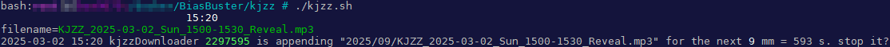
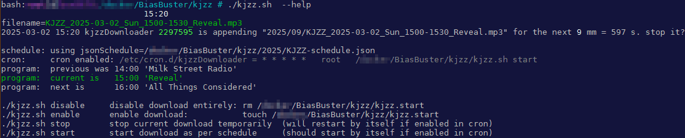
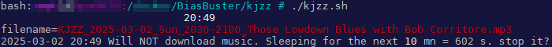

# BiasBuster - WIP 0.9.13 testing in progress... please wait

A set of tools which ultimate goal is to analyze biases in English Public Broadcasts.
Currently only handles KJZZ's radio broadcast.
Under active developement since 10/1/2023.

BiasBuster provides an cron 24/7 stream downloader, a SQLite database, 
and a Python script to output visual statistics and html pages to present all that within the broadcaster's schedule.

<div align="center"> 
  
  
  
  
  
  
</div>


The transcription is done with Whisper on GPU and produces text files and captions in various formats.
They are then processed by a python script that updates SQLite, and outputs html files and word cloud images, etc.
PNG files are compressed by pngquant to save space.

This project comes in 2 parts: 
- A Linux side:
  - kjzz.sh: cron downloads mp3 chunks based off the json schedule; appends/restarts downloads
- A Windows side:
  - BiasBuster-whisper.cmd: calls whisper-faster to transcribe mp3 to text; model distil-large-v3 recommended.
  - KJZZ-db.py: process and loads transcriptions into SQLite, outputs html, statistics, word clouds etc

The Windows part could run on Linux as well. The whisper part can use CPU (slower), and the processing batch should be rewritten in bash easily.


These schedules are hosted temporarily here: https://www.derewonko.com/kjzz/48/index.html


# Under the hood

## Linux part: kjzz.sh
Currently, this application only downloads KJZZ's broadcast, available at https://kjzz.streamguys1.com/kjzz_mp3_128

You can certainly rewrite it for Windows if you like.

### Usage
Script usage:
- *disable*:  disable automated downloads (equivalent to `rm kjzz.start`)
- *enable*:   enable automated downloads (equivalent to `touch kjzz.start`)
- *start*:    starts the download according to `KJZZ-schedule.json` (that should be in cron.d)
- *stop*:     kills current download if you want to (cron will restart it if still in cron.d)
- *--help*:   display some help and debug info

`kjzz.sh` will download chunks of 30mn, excluding the musical programs of the night (sleep). Simply schedule CRON with this one line, to get 30mn mp3 file chunks under YEAR/ISO week number folders (week starts Monday):
`# 0,1,30,31 * * * *   root /path/BiasBuster/kjzz.sh start`

This script will create a pid lock file with its runing PID, ensuring only one runs at a time. When you call the script, it will tell you if it's running or not. Example:
`./kjzz.sh`


`./kjzz.sh --help`


`./kjzz.sh` while asleep (musical programs excluded by hard-coded keywords: *Blues* and *Jazz*)



### KJZZ schedule: KJZZ-schedule.json
This schedule comes from their official website at https://kjzz.org/kjzz-print-schedule

The structure is pretty simple, and simply lists by hour then by Day, the title of the program/segment/show:
```
{
  "00:00": {
    "Mon": "BBC World Service",
    "Tue": "Classic Jazz with Chazz Rayburn",
    "Wed": "Classic Jazz with Bryan Houston",
    "Thu": "Classic Jazz with Bryan Houston",
    "Fri": "Classic Jazz with Michele Robins",
    "Sat": "Classic Jazz with Michele Robins",
    "Sun": "BBC World Service"
  },
  ...
```

The latest schedule `KJZZ-schedule.json` shall be placed at the root of the project, then under YEAR/ folder, then named KJZZ-schedule-YYYYMMDD.json if it changes at that date.
- The schedule changes every year or so, keep an eye at https://kjzz.org/kjzz-print-schedule and update the json.
  - To add an updated schedule, simply add a new `KJZZ-schedule.json` under YEAR/ folder
  - To add an updated schedule to , simply add a new `KJZZ-schedule.json` under YEAR/ folder
- No handling of other radio broadcasts yet.


## Windows part 1: BiasBuster-whisper.cmd
- Transcribe the mp3 to text with Purfview/whisper-standalone-win and CUDA.
The whole point of using Windows is to put this GTX 3090 to good use. 
Whisper-Faster is compiled and ready to use. 

I tried my best to compile whisper, whisper-bin-x64, and whisper-cpp, but failed miserably. 
Compiling it on Windows apparently requires you to install 6GB of CUDA SDK. My C: drive is full, sorry.
Another project called [Whisper JAX](https://github.com/sanchit-gandhi/whisper-jax) claim to be even 6x faster but works only on Linux.

### How to use this script:

1. Have a CUDA GPU
2. install Whisper-Faster from https://github.com/Purfview/whisper-standalone-win
3. add cuBLAS.and.cuDNN as required
4. update `BiasBuster-whisper_custom.cmd` to point to Whisper-Faster folder and binary, update the defaults as you need
5. Optional: copy `BiasBuster-whisper.cmd` as a shortcut in the sendTo folder (access by typing `shell:sendTo`)
6. download mp3 from your Cloud server
7. right-click the folder and select _BiasBuster-whisper_
8. watch the magic of Machine Learning transcription (Machine/Deep Learning is not AI)


* The script as it is, will produce all text and caption files whisper-faster can produce.
  - vtt + text account for rougly 15MB per week.
* The python app only use `.text` extensions to load into the database, 
* The html pages generated only use `.vtt` as subtitles when playing the chunks.
  - each 30mn mp3 chunk is 27.5MB at 128kbs
  - OpenPlayerJS is integrated within the html pages (created by kjzz-db.py), and will load those `vtt` caption files.

In the future we could simply save only the vtt into the database. But a dynamic page would be necessary.

### Whisper vs Whisper-Faster vs Faster-Whisper-XXL
- Whisper is from OpenAI
- Whisper-Faster is a Windows-compiled version using not OpenAI models, faster then the above
- Faster-Whisper-XXL is the latest Windows-compiled using latest models, faster then the above

### Which models to use?
- time vs quality is to be considered. Time is money (in the form of electricity bills).
- Quality is relative and all models make mistakes, some less then others.
- Pure english models struggle a little more with KJZZ in particular because so many speakers (especially BBC reporting) are foreign with thick accents.
- Overall, `small` gave the best results consistently, in regard to time spent.
- latest distil-v3 seems to beat all of them in regard to the time saved (2x faster then small).

### Models comparison
I made a comparison of outputs for the first chunk I ever downloaded: [a 30mn BBC World Service program](assets/compare/KJZZ_2023-10-08_Sun_2300-2330_BBC%20World%20Service.mp3).
I ran some models on it and here are the conclusions, with `small` from Whisper-Faster 0.9.0 being the baseline:

1. small-wf-0.9.0 vs small-fw-xxl-1.1.0
- 97 seconds for both.
- xxl has much better punctuation with much more commas, and correct spelling of acronyms: UN vs U.N. etc.
- xxl has very few sentences missing.
- 0.9.0 miss many starting sentence words such as So, Do, etc.
This is a no-brainer, switch to small-fw-xxl-1.1.0

2. small-fw-xxl-1.1.0 vs medium-fw-xxl-1.1.0
- 97 vs 168 seconds.
- missing acronyms improvements from small, I do not trust it.
- Plus it's 2x slower.
Can be discarded.

3. small-fw-xxl-1.1.0 vs turbo-fw-xxl-1.1.0
- 97 vs 65 seconds.
- Outputs are very similar, turbo being faster.
- turbo **hallucinates** and added all these sentences at the end of the program, while only speechless music was playing:
  ```
  We'll be right back in the story.
  I'll see you.
  Thanks.
  And this is the first sentence.
  ```
- turbo misses long sentences and replace them by `...`
I do not recommend turbo.

4. small-fw-xxl-1.1.0 vs distil-large-v3-fw-xxl-1.1.0
- 97 vs 48 seconds.
- just like medium, distil also misses the correct acronyms spelling.
- aside from being 2x faster then small, it makes similar mistakes at different positions.
- mistakes visible especially with forgein speakers with thick accent.
Distil output looks better overall, but I am biased by the 2x speed improvement over Small. I recommend it nonetheless.
,=


## Windows part 2: KJZZ-db.py
This Python script does the following:

- Load the text files into SQLite `kjzz.db`
- Exploits the data to produce statistics and graphics
  - [x] import single mp3
  - [x] import all mp3 in a folder
  - [x] query statistics on what is stored
  - [x] query words based on schedule
  - [x] generate word cloud
  - [x] generate misInformation analysis heatmap only for programs
  - [x] generate html week pages for chunks
  - [x] generate html week pages for programs
  - [x] generate html week pages that have pictures
  - [x] generate html week pages that have links
  - [x] generate html week pages that can navigate
  - [x] generate html week pages and also missing wordCloud pictures
  - [ ] generate gender bias analysis
  - [ ] generate html week pages that are useful
  - [x] generate html week pages that are interactive
  - [ ] see roadmap ...


# KJZZ-db.py Usage

KJZZ-db.py needs at least `--import / --query / --gettext / --listLevel`.
`python KJZZ-db.py --help`

```
usage: python KJZZ-db.py --help
Required at least: --import / --query / --gettext / --listLevel

  --import < --text "KJZZ_2023-10-13_Fri_1700-1730_All Things Considered.text" | --folder inputFolder >
    -m, --model *small medium large...
                   Model that you used with whisper, to transcribe the text to import.
    -p, --pretty
                   Convert \n to carriage returns and does json2text.
                   Ignored when outputing pictures.
    --output *kjzz
                   Folder where to output pictures..
    --show
                   Opens the picture upon generation.
    --rebuildThumbnails <week>
                   Will (re)generate PICtures thumbnails only for that week.
    --dryRun
                   Will not generate PICtures, will not import or update the database.
    --noPics
                   Will not generate PICtures.
    --force
                   Will regenerate existing PICtures.

  --db *kjzz.db    Path to the local SQlite db.
  -q, --query < title | first | last | last10 | byDay | byTitle | chunkLast10 >
                   Quick and dirty way to see what's in the db.

  --html [--byChunk --printOut --autoGenerate] <week>
                   PICture: generate week number's schedule as an html table.
                   Outputs html file: kjzz/week00[-byChunk].html
                   --byChunk  Outputs schedule by 30mn chucks, no rowspan, no picture.
                   --printOut Will output html on the prompt.
                   --autoGenerate Will loop generate all wordCloud PICtures to show in html for that week.

  -g, --gettext < selector=value : chunk= | date= | datetime= | week= | Day= | time= | title= >
                   Outputs all text from the selector:
                   chunk="KJZZ_YYYY-mm-DD_Ddd_HHMM-HHMM_Title" (run "python KJZZ-db.py -q chunkLast10" to get some values)
                   date=2023-10-08[+time=HH:MM]
                   datetime="2023-10-08 HH:MM"
                   week=42 (iso week with Mon first)
                   Day=Fri (Ddd)
                   title="title of the show", see https://kjzz.org/kjzz-print-schedule
          example: chunk="KJZZ_2023-10-13_Fri_1700-1730_All Things Considered"
                   Will get text from that chunk of programming only. Chunks are 30mn long.
          example: week=41+Day=Fri+title="All Things Considered"
                   Same as above but will get text from the entire episode.
   *--printOut
                   Will output selected text on the prompt (default if no other option passed).
    --noMerge
                   Do not merge 30mn chunks of the same title within the same timeframe.
    --misInformation
                   PICture: generate misInformation graph or heatmap for all 4 factors:
                   explanatory/retractors/sourcing/uncertainty
      --graphs *bar,*pie,line
                   What graph(s) you want. Ignored with --noMerge: a heatMap will be generated instead.
    --wordCloud
                   PICture: generate word cloud from gettext output. Will not output any text.
      --noPngquant
                   Disable pngquant compression
      --useJpeg
                   Produces jpeg instead of png
      --jpegQuality <*50>
                   0-100 jpeg quality
      --stopLevel  0 1 2 *3
                   add various levels of stopwords
        --listLevel <0[,1 ..]> to just show the words in that level(s).

      --max_words *1000 int (default=1000)
               The maximum number of words in the Cloud.
      --width *2000 int (default=2000)
               Width of the canvas.
      --height *1000 int (default=1000)
               Height of the canvas.
      --min_word_length *3 int, default=3
               Minimum number of letters a word must have to be included.
      --min_font_size *4 int (default=4)
               Smallest font size to use. Will stop when there is no more room in this size.
      --max_font_size *400  int or None (default=400)
               Maximum font size for the largest word. If None, height of the image is used.
      --scale *1.0 float (default=1.0)
               Scaling between computation and drawing. For large word-cloud images,
               using scale instead of larger canvas size is significantly faster, but
               might lead to a coarser fit for the words.
      --relative_scaling *auto float (default='auto')
               Importance of relative word frequencies for font-size.  With
               relative_scaling=0, only word-ranks are considered.  With
               relative_scaling=1, a word that is twice as frequent will have twice
               the size.  If you want to consider the word frequencies and not only
               their rank, relative_scaling around .5 often looks good.
               If 'auto' it will be set to 0.5 unless repeat is true, in which
               case it will be set to 0.
      --background_color *white color value (default='white')
               Background color for the word cloud image.
      --normalize_plurals *True bool, default=True
               Whether to remove trailing 's' from words. If True and a word
               appears with and without a trailing 's', the one with trailing 's'
               is removed and its counts are added to the version without
               trailing 's' -- unless the word ends with 'ss'. Ignored if using
               generate_from_frequencies.
      --inputStopWordsFiles *[] file, default=None
               Text file containing one stopWord per line.
               You can pass --inputStopWordsFiles multiple times.
      --font_path *fonts\Quicksand-Bold.ttf str, default='fonts\Quicksand-Bold.ttf'
               Font path to the font that will be used (OTF or TTF).
      --collocation_threshold *30 int, default=30
               Bigrams must have a Dunning likelihood collocation score greater than this
               parameter to be counted as bigrams. Default of 30 is arbitrary.
               See Manning, C.D., Manning, C.D. and Schütze, H., 1999. Foundations of
               Statistical Natural Language Processing. MIT press, p. 162
               https://nlp.stanford.edu/fsnlp/promo/colloc.pdf#page=22

  -v, --verbose
                   -vv -vvv increase verbosity.
  --silent
                   Not verbose.
```

## Import new data
`-i, --import` *--text file | --folder folder*

### File naming convention

#### For KJZZ
Mp3 files must be named like so, in order to be matched against KJZZ-schedule.json during loading of the database:

```
KJZZ_2023-10-13_Fri_1700-1730_All Things Considered.text
     ^          ^   ^         ^                     ^
     YYYY-MM-DD Day HHMM      Program name          text (for folder import)
```

_Day_ is redundant since we have the date, but makes the chunk name and database, convenient to interact with.

### Import text files in the Database
`python KJZZ-db.py --import --folder kjzz\\42`

Will import every text file in the folder "kjzz\42" (week 42).
--import will always avoid chunks already present in the database unless you add --force.

```
  db_init: 314 chunks found in kjzz.db
    db_load: Chunk already exist: KJZZ_2023-10-16_Mon_0000-0030_BBC World Service.text
    db_load: Chunk already exist: KJZZ_2023-10-16_Mon_0030-0100_BBC World Service.text
    ...
    db_load: Chunk added: KJZZ_2023-10-18_Wed_1030-1100_Here and Now.text
    db_load: Chunk added: KJZZ_2023-10-18_Wed_1100-1130_Here and Now.text
    ...
Loading... ---------------------------------------- 100% 0:00:00
  db_load: done loading 53/146 files
```

## Query database
`-q, --query` *title first last last10 byDay byTitle chunkLast10*

Quick and dirty way to see what's in the db.


### Database titles overview

`python KJZZ-db.py -q byTitle`

Outputs how many 30mn chunks are stored, by title and by Day:
```
[
  ('All Things Considered', 'Fri', 6),
  ('All Things Considered', 'Mon', 6),
  ('All Things Considered', 'Sat', 2),
  ('All Things Considered', 'Sun', 2),
  ...
```

### Database title flat listing

`python KJZZ-db.py -q title --pretty`

Outputs alphabetically sorted list of all programing in the database, useful for loops for instance:
```
"All Things Considered"
"BBC Newshour"
"BBC World Business Report"
"BBC World Service"
"Bullseye"
"Climate One"
...
```

### List the last chunks loaded
`python KJZZ-db.py --query chunkLast10 -pretty`

Adding _pretty_ will flatten the output as simple text:

```
"KJZZ_2023-10-19_Thu_1930-2000_Fresh Air"
"KJZZ_2023-10-19_Thu_1900-1930_Fresh Air"
"KJZZ_2023-10-19_Thu_1830-1900_BBC World Business Report"
"KJZZ_2023-10-19_Thu_1800-1830_Marketplace"
"KJZZ_2023-10-19_Thu_1730-1800_All Things Considered"
"KJZZ_2023-10-19_Thu_1700-1730_All Things Considered"
"KJZZ_2023-10-19_Thu_1630-1700_All Things Considered"
"KJZZ_2023-10-19_Thu_1600-1630_All Things Considered"
"KJZZ_2023-10-19_Thu_1530-1600_All Things Considered"
"KJZZ_2023-10-19_Thu_1500-1530_All Things Considered"
```

## gettext
`-g, --gettext` * chunk= | date= | datetime= | week= | Day= | time= | title= *

validKeys = they will be used as parameters for the SQL query:
- chunk="KJZZ_YYYY-mm-DD_Ddd_HHMM-HHMM_Title"
- date=2023-10-08[+time=HH:MM]
- datetime="2023-10-08 HH:MM"
- week=42 (iso week with Mon first)
- Day=Fri (Ddd)
- title="title of the show", see https://kjzz.org/kjzz-print-schedule


You can also combine the keys with *+*, examples:
- ALL of BBC Newshour for week 41: `--gettext week=41+title="BBC Newshour"`
- ALL programs for a specific day [and time]: `--gettext date=2023-10-08[+time=HH:MM]`
- ALL programs for a specific week: `--gettext week=42`
- Specific date and time (30mn chunk): `--gettext datetime="2023-10-08 HH:MM"`

--stopLevel 3 is used by default; Look in the script what words the various levels contain, or type this to find out:
`python KJZZ-db.py --listLevel 0,1`

```
0: basic stopWords
  {'being', "i'm", "hadn't", "he'd", 'you', 'yours', "mustn't", 'about', "he'll", 'how', "what's", 'ours', 'my', 'what',
  'through', 'nor', "can't", 'cannot', 'have', 'other', 'over', 'otherwise', 'below', 'this', "let's", 'i', 'both',
  "where's", "it's", "i'd", 'we', 'against', 'where', 'to', 'for', 'itself', "shan't", 'can', 'does', 'just', 'out',
  "aren't", 'in', 'no', 'r', 'above', "they're", 'get', "she'll", 'shall', 'on', 'like', 'after', "shouldn't", 'having',
  'since', "we'd", "hasn't", 'because', 'been', 'ourselves', 'hers', 'until', "he's", 'should', "there's", "haven't",
  "we'll", 'all', 'an', 'however', 'again', "why's", 'a', 'once', 'than', "she'd", "we've", "couldn't", 'as', 'with',
  'myself', 'was', 'further', "isn't", 'the', 'and', 'your', 'why', 'his', 'so', 'only', 'him', 'between', 'by', 'few',
  'theirs', 'ought', 'most', 'they', 'under', 'which', 'its', 'of', 'some', 'whom', 'themselves', 'but', 'ever', 'down',
  'hence', 'own', "who's", 'am', 'off', 'who', 'such', 'same', 'doing', "won't", 'while', 'any', "here's", 'therefore',
  'could', 'k', 'had', 'when', 'yourself', 'be', "we're", 'herself', "they've", 'each', 'here', 'she', 'more', "i'll",
  "wasn't", "you'd", 'very', 'their', 'or', 'up', 'http', 'at', "i've", "weren't", 'yourselves', 'if', 'too', 'not',
  'himself', 'are', "didn't", 'did', 'do', 'from', "when's", "how's", 'during', 'then', "she's", 'them', 'has', 'it',
  "that's", "doesn't", 'those', 'me', 'her', 'into', "they'll", 'he', 'our', 'there', 'www', 'before', 'would', "they'd",
  "you'll", 'also', 'that', 'were', 'is', "wouldn't", 'com', 'these', 'else', "you're", "you've", "don't"}
1: more stopWords related to broadcasting speech. They compose 50% of modern speech structure's glue and have lost all meaning for Word Cloud analysis.
  {'mean', 'new', 'kind', 'case', 'called', 'report', 'things', 'need', 'morning', 'become', 'live', 'even', 'okay',
  'many', 'point', 'trying', 'lot', 'come', 'came', 'really', 'week', 'going', 'always', 'got', 'think', 're', 'good',
  'day', 'almost', 'first', 'two', 'comes', 'part', 'went', 'still', 'little', 'today', 'well', 'actually', 'take',
  'years', 'another', 'right', 'next', 'look', 'one', 'see', 'will', 'thing', 'know', 'back', 'said', 'says', 'last',
  'yeah', 'made', 'say', 'never', 'number', 'coming', 'want', 'something', 'show', 'talk', 'way', 'much', 'sort',
  'edition', 'time', 'year', 'around', 'now', 'let', 'work', 'hour', 'people'}
2: specific stopWords for KJZZ readio station
{'month', 'donation', 'thank', 'gift', 'NPR', 'org', 'org', 'you', 'help', 'please', 'doubled', 'news', 'KJZZ', 'KJZ',
'sustaining', 'member', 'make', 'contribution', 'call', 'give', 'BBC', 'support', 'drive'}
```

### Get the text for a particular chunk
`python KJZZ-db.py --gettext chunk="KJZZ_2023-10-13_Fri_1700-1730_All Things Considered" -p`


### Get the text for a particular program, ALL dates (slow)
`python KJZZ-db.py --gettext title="All Things Considered" -p`


### Generate a word Cloud for a program, on a specific week and Day
`python KJZZ-db.py -g week=42+title="Freakonomics"+Day=Sun --wordCloud`--show --max_words=1000

Same but If you know the actual date:
`python KJZZ-db.py -g week=42+title="Freakonomics"+Day=Sun --wordCloud`--show --max_words=1000


### Generate a word Cloud for a particular chunk of program
`python KJZZ-db.py -g chunk="KJZZ_2023-10-19_Thu_1500-1530_All Things Considered" -v --wordCloud`

Verbose outpout:
```
wordCloud:     True
localSqlDb kjzz.db passed
  db_init kjzz.db
    cursor: 1 records
  db_init: 367 chunks found in kjzz.db
  gettext: SELECT text from schedule where 1=1 and start = '2023-10-19 15:00:00.000'
    cursor: 1 records
  gettext: image 1
    genWordCloud: most 10 common words before: [('the', 208), ('to', 142), ('a', 114), ('of', 110), ('in', 91), ('and', 89), ('that', 73), ('is',
70), ('this', 58), ('on', 49)]
    genWordCloud: most 10 common words after:  [('s', 68), ('you', 41), ('I', 37), ('are', 34), ('from', 32), ('they', 32), ('have', 24), ('like',
24), ('was', 23), ('so', 23)]
    genWordCloud: 4952 words - 195 stopWords == 3694 total words (1258 words removed)
    genWordCloud: stopWords = {"we're", 'nor', 'start=2023-10-19', 'they', "doesn't", 'we', 'on', 'me', 'can', 'out', 'get', "she's", 'about',
'few', 'once', "we'd", "you'd", 'of', "here's", 'is', 'www', 'but', "he'd", 'to', 'both', 'k', 'below', 'was', 'themselves', 'could', 'up',
'while', 'where', 'other', "shouldn't", 'like', 'or', 'same', 'what', 'myself', "it's", 'our', 'how', 'doing', 'her', 'ours', 'such', 'further',
'my', "there's", "couldn't", "they've", 'only', "i'll", 'it', 'then', 'therefore', 'else', 'which', 'after', 'just', 'for', 'be', 'very', 'at',
'are', 'since', 'being', 'r', 'against', 'too', 'should', 'having', 'were', 'in', 'them', "you're", 'yours', 'KJZZ', 'into', 'however', 'if',
'through', "why's", 'all', 'himself', 'more', "you've", 'otherwise', 'did', "she'd", "what's", "she'll", 'who', 'own', "wasn't", 'during',
"you'll", 'their', 'here', "won't", 'those', 'you', "who's", "didn't", "where's", 'has', "shan't", 'no', 'not', "can't", "hadn't", 'http',
'again', "don't", 'i', "aren't", 'ever', "let's", 'hence', 'with', 'until', 'whom', 'why', 'had', 'been', 'there', 'under', "we'll", "i'm",
'yourselves', 'am', "i'd", 'above', 'as', 'over', 'this', 'some', 'each', 'itself', 'from', 'between', 'that', "when's", "they're", 'off', 'any',
'an', 'the', "isn't", '15:00', 'and', "i've", 'his', "hasn't", 'most', "he'll", 'a', 'when', 'these', 'hers', 'by', "weren't", 'com', 'also',
'its', 'your', 'cannot', "haven't", "wouldn't", 'before', "they'll", 'than', 'yourself', 'ourselves', "he's", 'him', "how's", "they'd", 'ought',
"that's", 'because', 'do', 'herself', 'down', 'shall', 'she', 'he', 'does', "we've", 'so', 'would', 'have', "mustn't", 'theirs'}
    genWordCloud: file = "KJZZ start=2023-10-19 1500 words=4952 max=4000 scale=0.png"
```

wordCloud generated: Notice how it makes no sense as onlt the stop words are highlighted


### Generate a cloud a an episode of "Freakonomics" on week 42
`python KJZZ-db.py -g week=42+title="Freakonomics" --wordCloud --show --max_words=1000 --inputStopWordsFiles data\stopWords.Wordlist-Adjectives-All.txt`


### Generate a cloud a an episode of "Freakonomics" on week 42 with smaller max font size
`python KJZZ-db.py -g week=42+title="Freakonomics" --wordCloud --show --max_words=1000 --inputStopWordsFiles data\stopWords.Wordlist-Adjectives-All.txt`

Notice how more smaller words are stacked and make the cloud illegible:


### Generate a cloud a an episode of "Freakonomics" on week 42 without stopWords

No stopWords: adjectives are now prominents and the cloud has no meaning anymore:

`python KJZZ-db.py -g week=42+title="Freakonomics" --wordCloud --stopLevel 0 --show --max_words=1000`


### Generate PIE+BAR graphs about how uncertain information is in a program

`python KJZZ-db.py --gettext week=46+title="Morning Edition"+Day=Tue --misInformation --graphs bar,pie --show`


### Generate a heat map about how uncertain information is in multiple chunks of a program

Simply add --noMerge: --graph will be ignored when treating multiple chunks, and output a heat map instead.

`python KJZZ-db.py --gettext week=46+title="Morning Edition"+Day=Tue --misInformation --noMerge --show`


### Batch to generate JUST wordCloud pictures for a week

The loop below will generate png files for each program of each day of week 42, manually:

`for /f "tokens=*" %t in ('python KJZZ-db.py -q title -p') DO (for %d in (Mon Tue Wed Thu Fri Sat Sun) DO python KJZZ-db.py -g week=42+title=%t+Day=%d --wordCloud --max_words=1000 --inputStopWordsFiles data\stopWords.ranks.nl.uniq.txt --inputStopWordsFiles data\stopWords.Wordlist-Adjectives-All.txt --output kjzz)`

Notice how the order of --gettext parameters influence the file names: 
this is useful when you want your files sorted a certain way. 

The loop above will have them sorted by Title. 
If you want to have them sorted by Day, use `week=42+Day=%d+title=%t`.

Now, there is a much easier way to generate all those wordCloud pictures.

### Generate html page for a week + wordCloud pictures

Automatically: this command will generate week's 42 schedule html page, linking available wordCloud pictures:

`python KJZZ-db.py --html 42 --autoGenerate --inputStopWordsFiles data\stopWords.ranks.nl.uniq.txt --inputStopWordsFiles data\stopWords.Wordlist-Adjectives-All.txt`


Manually: the loop below will generate only the wordCloud files:

```
REM (re)generate all thumbnails for week 42 manually:
for /f "tokens=*" %t in ('python KJZZ-db.py -q title -p') DO (for %d in (Mon Tue Wed Thu Fri Sat Sun) DO python KJZZ-db.py -g week=42+title=%t+Day=%d --wordCloud --max_words=1000 --inputStopWordsFiles data\stopWords.ranks.nl.uniq.txt --inputStopWordsFiles data\stopWords.Wordlist-Adjectives-All.txt --output kjzz)
```
Notice how the order of --gettext parameters influence the file names: 
this is useful when you want your files sorted a certain way. 

The loop above will have them sorted by Title. 
If you want to have them sorted by Day, use `week=42+Day=%d+title=%t`.


# Requirements

## Linux

- none

## Windows

- Python 3.x:
  - getopt, sys, os, re, regex, io, glob, time, datetime, pathlib, json, urllib, random, sqlite3, collections
- Python 3.x modules:
  - rich
  - pandas
  - numpy
  - matplotlib
  - seaborn
  - wordcloud
  - pngquant
- Windows software:
  - busybox.exe
  - whisper-faster from https://github.com/Purfview/whisper-standalone-win


# Acknowledgements
- busybox:        https://busybox.net/
- rich print:     https://github.com/Textualize/rich
- pngquant:       https://github.com/kornelski/pngquant
- wordCloud:      https://github.com/amueller/word_cloud
- gender bias:    https://github.com/auroracramer/language-model-bias
- misInformation: https://github.com/PDXBek/Misinformation
  - heatMap.explanatory.csv
  - heatMap.retractors.csv
  - heatMap.sourcing.csv
  - heatMap.uncertainty.csv
- IA transcribe:  https://github.com/Purfview/whisper-standalone-win
- stopWords lists: 
  - ranks.nl compilation:     https://www.ranks.nl/stopwords
    - stopWords.ranks.nl.txt
  - Thesaurus and adjectives: https://github.com/taikuukaits/SimpleWordlists/tree/master
    - stopWords.Wordlist-Adjectives-All.txt
- mp3 player:     OpenPlayer.js https://github.com/openplayerjs/openplayerjs/


# Support

👍🏻 If you're using this project & happy with it or you appreciate what I do and wish to support my work, you can consider by

⭐️ Starring & Sharing the project is also appreciated. Thanks! ❤️
[](https://reddit.com/submit?url=https://github.com/audioscavenger/BiasBuster&title=Discover%20the%20bias%20and%20the%20agenda%20of%20KJZZ%20radio%20broadcasts)
[](https://news.ycombinator.com/submitlink?u=https://github.com/audioscavenger/BiasBuster)
[](https://twitter.com/share?url=https://github.com/audioscavenger/BiasBuster&text=Discover%20the%20bias%20and%20the%20agenda%20of%20KJZZ%20radio%20broadcasts)
[](https://www.facebook.com/sharer/sharer.php?u=https://github.com/audioscavenger/BiasBuster)
[](https://www.linkedin.com/shareArticle?url=https://github.com/audioscavenger/BiasBuster&title=Discover%20the%20bias%20and%20the%20agenda%20of%20KJZZ%20radio%20broadcasts)

# Contribution

I will be open to any contribution. If you have any idea, please let me know. 
I am by no means an expert in English language or statistics. Any idea to help reveal the agenda of the programmings are welcome.

# License

This project is under [GPL-2.0](https://github.com/audioscavenger/BiasBuster/blob/master/LICENSE) License.

# Roadmap
Scope creep ahead...

- [ ] WIP
  - [ ] misc
  - [ ] db
    - [ ] add statistics table or more columns for each chunk?
    - [ ] how to store statistics for segments rather then chunks?
  - [ ] ui
    - [ ] start to think about how to access the misInformation heatmaps
    - [ ] make text icons also a modal
    - [ ] integrate text analysis with keyword search in a modal
    - [ ] fix table header that's transparent when scrolling down
    - [ ] add a modal for statistical analysis of a program
    - [ ] front page: add social media share buttons for that modal
    - [ ] front page: highlight the top 10 BS of the week or smth
    - [ ] integrate front page with cgi or smth so we can ajax-build missing pictures or smth and spare dev of a dynamic page
    - [ ] integrate front page with cgi so we can tap in the database with SQLite worker and spare dev of a dynamic page
    - [ ] also compute a wordCloud per chunk and show it in the tooltip?
    - [ ] player handles playlist?
    - [ ] segments have only 1 play button that loads a playlist? how about the texts?
  - [ ] python
    - [ ] change gettext time= to start=|stop= instead, so we can generate same segments as by week+title+Day
    - [ ] rename title to segment or show? they seem to call their programmings "shows"
    - [ ] color wordClouds by bias/misInformation/etc
    - [ ] add --saveProfile --listProfiles --listProfiles
    - [ ] add saveProfile() loadProfile() functions
    - [ ] extract presenters' names
    - [ ] should the case matter for title?
    - [ ] add bias_score.py from https://github.com/auroracramer/language-model-bias
    - [ ] add metadata in EXIF
    - [ ] check if AVIF/WebP would be a better choice then png for word clouds
  - [ ] misc
    - [ ] BUG: 0 bytes mp3 will crash the batch completely
    - [ ] BUG: streams sometimes interrupt for reasons. Must find a way to restart the download
    - [ ] integrate AI summarization with **h2ogpt** or **text-generation-webui**, and Summarization model such as *impira_layoutlm-document-qa*
    - [ ] use AI to detect and build ads stopWords
    - [ ] integrate (re)generate misInformation heatMap(s)
    - [ ] integrate (re)generate biase(s)
    - [ ] automate transcription and server updates
    - [ ] auto-import mp3 to process via ssl batch putty or plink or smth
    - [ ] auto-upload processed text back to server via ssl batch putty or plink or smth
    - [ ] include some of the most offensive Hexspeak from https://en.wikipedia.org/wiki/Hexspeak to trigger fools
    - [ ] separate KJZZ into its own table to add other broadcasters
    - [ ] automate mp3 downloads from cloud + process + uploads from/to cloud server
  - [ ] future
    - [ ] dynamic page in PHP or nodeJS/typeScript
- [x] release 0.9.13 downloader
  - [x] kjzz.sh
    - [x] major bug discovered in isoweek values of %V%G versus %W%U/%Y: we switched to %W as strftime('%W','2025-01-01') gives same values
    - [x] schedules format is KJZZ-schedule.json, KJZZ-schedule-20240101.json, KJZZ-schedule-20240415.json
    - [x] moved all schedules to the ROOT
    - [x] updated KJZZ-schedule.json for 2024 and 2025
    - [x] kjzz.sh now handle multiple schedule updates
    - [x] kjzz.sh now has 3 more parameters and shows previous/next program with --help
    - [x] kjzz.sh does not log each download anymore, I fail to see the point in keeping them
  - [x] Windows part 1
    - [x] BiasBuster-whisper.cmd updated paramaters for latest Faster-Whisper-XXL r245.2 distil-large-v3
  - [x] python
    - [ ] revamp of --help
    - [ ] revamp of --help
    - [ ] test --text if it needs folder path or not
    - [ ] test weekNumber 1 vs 01
    - [ ] detect multiple schedules and load the right one as needed
    - [x] removed autoGenerate option, we always generate pics with --hrml unless --noPics is present
    - [x] saveImage() now works for PIL and pyplot
    - [x] saveImage() from save_image_extended: now accepts avif webp jxl etc
    - [x] inputFile detection and Chunk class now handle yearNumber
    - [x] add yearNumber to weekNumber handling
  - [x] ui
    - [ ] upgrade OpenPlayerJS
    - [ ] fix closed captions not showing up anymore
    - [x] add yearNumber navigation
    - [x] rename ui-child / style-child to ui-iframe / style-iframe
    - [x] updated index.html and index_template.html with year navigation
- [x] release 0.9.12 bugfixes
- [x] release 0.9.11 iframe
  - [x] ui
    - [x] disabled link checker as this is not production ready
    - [x] navBar swap with inline template tag, updateNavBar() and interpolate()
    - [x] keep player playing while navigating like plex => iframe like Plex
    - [x] proper iframe navigation
    - [x] frontpage added: index_template.html
  - [x] python
    - [x] utf-8 encoding everywhere
    - [x] now passing actual start stop times + chunkName in records
    - [x] created class TimeDict
    - [x] merged getText() and getChunkNames() into getChunks()
    - [x] color play buttons by bias/misInformation/etc
- [x] release 0.9.10 data_folder
  - [x] db
    - [x] switch db to PRAGMA temp_store = 2 (MEMORY)
    - [x] created indexes and tested them: they work and somewhat speed up cursors
    - [x] store misInfo statistics as text
  - [x] ui
    - [x] enable closed-captions by default: asked on stackoverflow and found a workaround
  - [x] python
    - [x] refactor Chunk() to separate sentences properly
    - [x] should genMisinfoBarGraph and genMisinfoHeatMap always overwrite existing png? NO: now using --force
    - [x] loadDictHeatMap with synonyms each time is too slow, rewrite function
    - [x] added --noPics
    - [x] load and save misInfo so we can avoid heavy processing for genMisinfoBarGraph and genMisinfoHeatMap
    - [x] cleaned up many functions and info levels
    - [x] simplified info messages
    - [x] created saveImage and saveThumbnail
    - [x] refactored stopLevel and dictStopWords
    - [x] move all stopLevels off Python into text files under data\
    - [x] add --useJpeg and --jpegQuality but it's actually worse
    - [x] enable string.Template instead of those %s everywhere
    - [x] tried to improve import speed with BEGIN+COMMIT but error: You can only execute one statement at a time.
    - [x] added jpeg output but for same size, quality is attrocious
    - [x] (re)generate both byChunk and bySegment schedules html files
    - [x] bugfix in genHtml where same program image was generated multiple times (1 per startTime withing the segment)
    - [x] add --rebuildThumbnails to (re)generate only thumbnails by week
  - [x] misc
    - [x] move all stopWords and stuff under data\
- [x] 0.9.9   release better_ui
  - [x] ui
    - [x] add link to switch between byChunk and not
    - [x] click to open image
    - [x] classes to highlight available segments
    - [x] integrate listen to available recordings
    - [x] add tooltips for play buttons
    - [x] fix semi-transparent header and OpenPlayer look
    - [x] optimize schedule pictures with thumbnails
    - [x] XHR check previous and next week's folder to avoid invalid links
    - [x] add lazy load images
    - [x] integrate mp3 player: OpenPlayerJS
    - [x] integrate closed-captions with OpenPlayerJS
    - [x] integrate fontAwesome6
    - [x] add view captioning text buttons
    - [x] add random ?value to custom css and js because of server caching
    - [x] display image in modal + zoom and drag
    - [x] close image modal onclick anywhere outside image
    - [x] cleanup genHtml() code by exporting stuff in sub functions
- [x] 0.9.8   release html_builder
  - [x] stopped uploading the db after week 46: `git update-index --assume-unchanged kjzz.db`
  - [x] fixed error Tcl_AsyncDelete: async handler deleted by the wrong thread
  - [x] updated README.md
  - [x] wordCloud() and genWordCloud() can be called from anywhere
  - [x] added plt.close() to save memory
  - [x] rebuild wordCloud png file title where needed
  - [x] updated usage()
  - [x] passing progress bar value to relevant info() logger lines
  - [x] fixed logging levels almost everywhere
  - [x] renamed info to usage in wordCloudDict
  - [x] default stopLevel is indeed 4 not 0
  - [x] added automatic missing pictures where necessary
  - [x] added html progress bar
  - [x] added --autoGenerate and --dryRun
  - [x] frozen table headers
  - [x] added prev/next links
  - [x] perfected table generation
- [x] 0.9.7   standardised logging
  - [x] added --silent
  - [x] default verbose = 1
  - [x] standardised logging
- [x] 0.9.6   WIP web ui - actually just generates an html page of the week's programing
  - [x] added options --html --byChunk
  - [x] added home-made html table generator from json schedule
  - [x] html table has an okay look and shows existing wordClouds
  - [x] html and png are generated under their respective week's folder
  - [x] cleaned up usage() and created error() functions
  - [x] completed week 46 import
- [x] 0.9.5   added misInformation heatmap from https://github.com/PDXBek/Misinformation
- [x] 0.9.4   wordCloudDict parameters are auto-added to script arguments and --help is auto-build
- [x] 0.9.3   added and played with most of the genWordCloud parameters in wordCloudDict
- [x] 0.9.2   updated stopwords to level 5 + you can add many files with --inputStopWordsFiles
- [x] 0.9.1   added wordCloud from https://github.com/amueller/word_cloud/blob/main/examples/simple.py
- [x] 0.9.0   automated mp3 process with whisper-faster from https://github.com/Purfview/whisper-standalone-win

## :beer: Buy me a beer
Like my work? This tool helped you? Want to sponsor more awesomeness like this?

<p align="center">
 <p><a href="https://www.paypal.com/donate/?hosted_button_id=CD7P7PK3WP8WU"></a></p>
 <p>Paypal Donation QR code</p>
</p>

